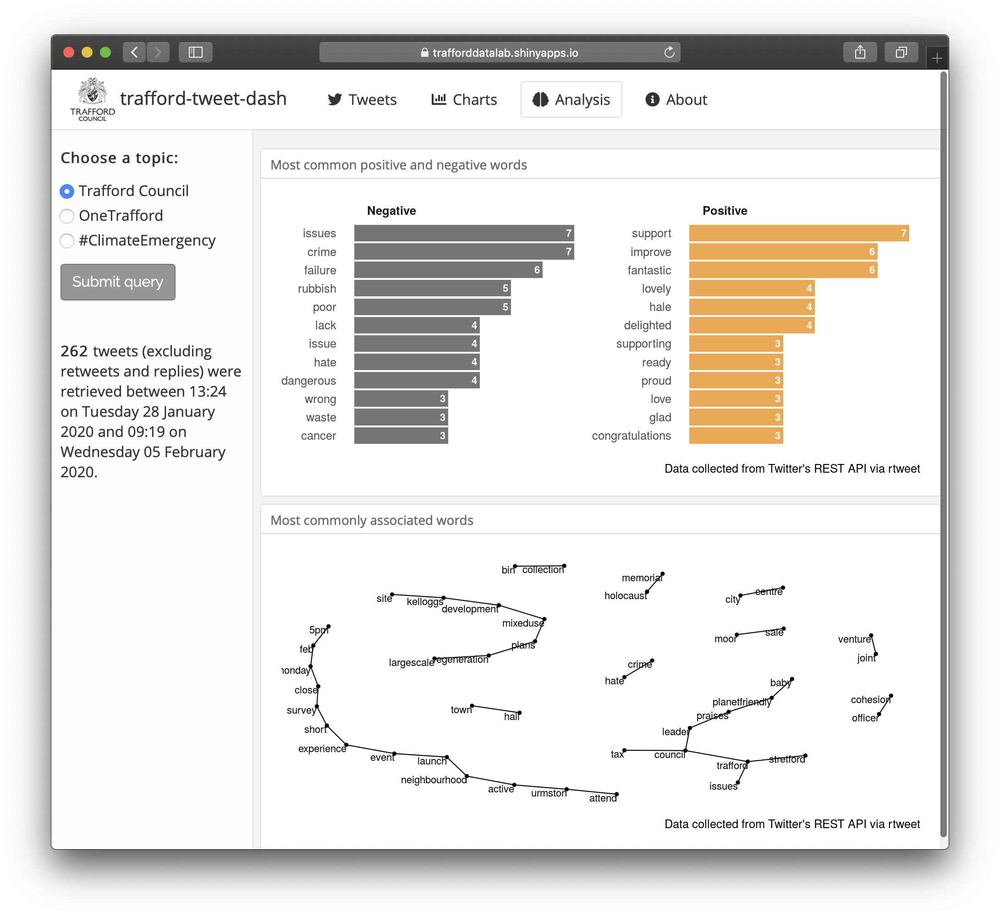

# trafford-tweet-dash

An application designed to help Trafford Council's officers and members better understand the needs and concerns of residents who use Twitter.    

 

The application was built in [R](https://cran.r-project.org/) [Shiny](https://cran.r-project.org/web/packages/shiny/index.html) using the [rtweet](https://cran.r-project.org/web/packages/rtweet/index.html) and [tidytext](https://cran.r-project.org/web/packages/tidytext/index.html) packages.
